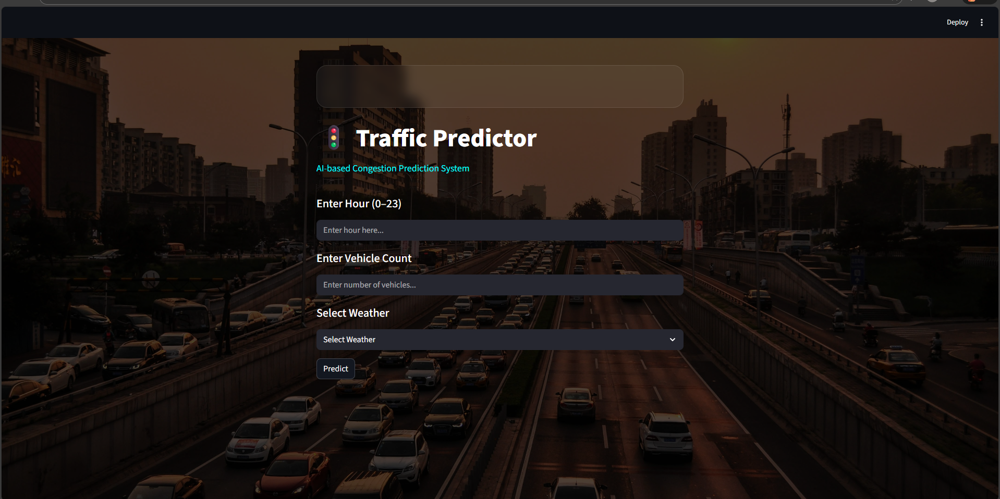

# 🚦 Smart Traffic Prediction System

An AI-based web application that predicts traffic congestion levels based on weather conditions using Machine Learning and Streamlit.

---

## 📌 Project Overview

This project uses machine learning techniques to predict traffic congestion by analyzing:

- Temperature
- Humidity
- Weather Conditions
- Time of Day

The model is trained using historical traffic and weather data and deployed using Streamlit for an interactive web interface.





---


## 🛠️ Tech Stack

- Python
- Pandas
- NumPy
- Scikit-learn
- Streamlit
- Matplotlib

---

## 🚀 How to Run the Project

### 1️⃣ Clone the repository

```bash
git clone https://github.com/AnkitaRameshNandgadkar/SmartTrafficPrediction.git
cd SmartTrafficPrediction
---

## 🧠 Machine Learning Workflow

1. Data Collection  
2. Data Preprocessing  
3. Feature Selection  
4. Model Training  
5. Model Evaluation  
6. Deployment using Streamlit  

---

## 💡 Use Case

This system can be used by:

- Smart City Projects
- Traffic Management Authorities
- Navigation Systems
- Urban Planning Departments

---

## 📊 Model Details

- Algorithm: Machine Learning Regression / Classification
- Input Features: Weather, Temperature, Humidity, Time
- Output: Traffic Congestion Level

---

## 🌐 Deployment (Future Scope)

- Streamlit Cloud
- AWS / Azure
- Docker Container

---

## ⭐ Support

If you like this project, please consider giving it a star ⭐ on GitHub!

---

## 📬 Contact

GitHub: https://github.com/AnkitaRameshNandgadkar
